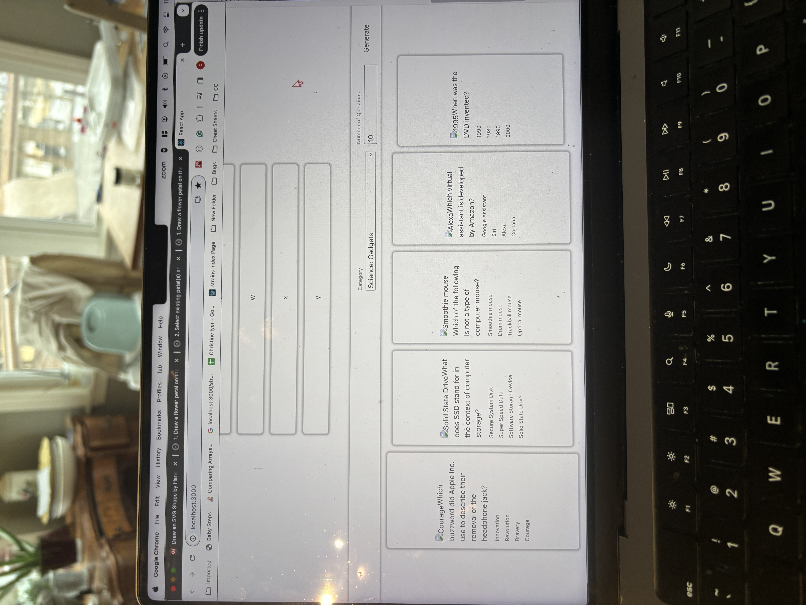

# Getting Started with Create React App

```
JS
const [ flip, setFlip]=useState(false)
<div>
        <DndContext
          collisionDetection={closestCenter}
          onDragEnd={handleDragEnd}
        >
          <Container className="p-3" style={{ "width": "11%" }} align="center">
            <h3>The best programming languages!</h3>
            <SortableContext
              items={languages}
              strategy={horizontalListSortingStrategy}
            >
              {/* We need components that use the useSortable hook */}
              {languages.map(language => <SortableItem key={language} id={language} />)}
            </SortableContext>
          </Container>
        </DndContext>
      </div>
```

## STATUS 3/7/2024


Ok pretty bad. Let's start taking it apart. See below 
⬇️⬇️⬇️⬇️⬇️⬇️⬇️⬇️⬇️⬇️
